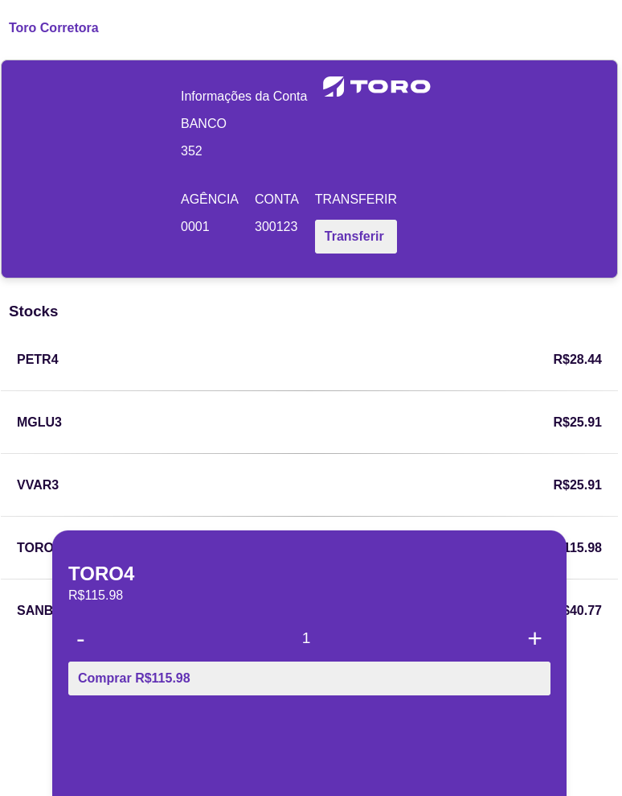

# Teste de Desenvolvimento - Toro

Este repositório contém um teste de desenvolvimento para a empresa Toro, utilizando Angular.

## Descrição

O teste consiste na implementação de diversos componentes e funcionalidades em uma aplicação Angular, incluindo:

- Componentes como `Account`, `Stocks`, `Modal`, `Toast`, e `Transfer`.
- Integração com uma API da Toro para obtenção de dados de ações e realização de transferências.
- Testes unitários e de integração para garantir o funcionamento correto dos componentes e funcionalidades.

## Tecnologias Utilizadas

- Angular
- TypeScript
- HTML/CSS

## Executando a Aplicação

1. Certifique-se de ter o Node.js e o Angular CLI instalados globalmente em sua máquina.
2. Clone este repositório git@github.com:alexandrejuk/toro-app.git.
3. Navegue até o diretório clonado e execute `npm install` para instalar as dependências.
4. Após a instalação das dependências, execute `ng serve` para iniciar o servidor de desenvolvimento.
5. Acesse `http://localhost:4200` em seu navegador para visualizar a aplicação.

## Executando Testes

- Execute `ng test` para executar os testes unitários via [Karma](https://karma-runner.github.io).

## Screenshot

## Autor

[Alexandre Soares](https://github.com/alexandrejuk)